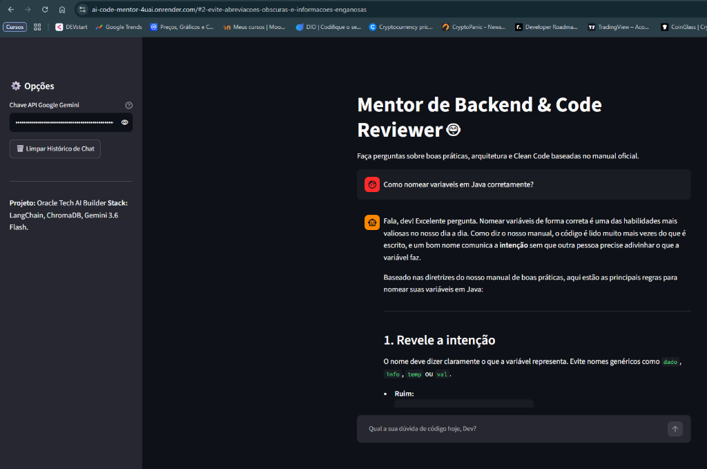
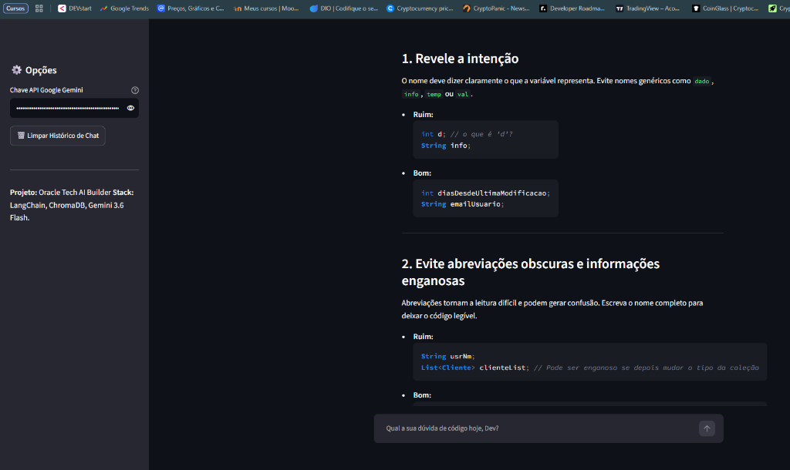
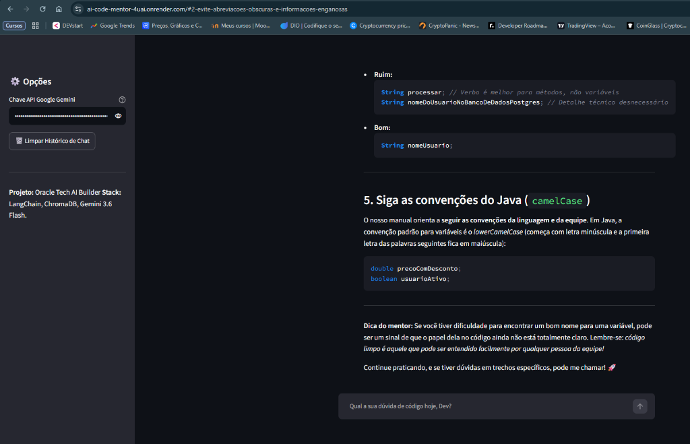
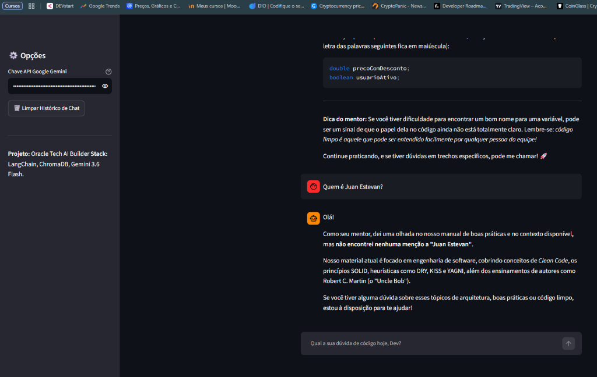
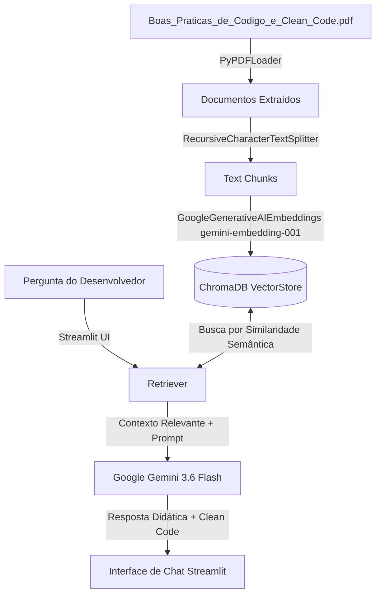

# Mentor de Backend & Code Reviewer 🤖

[](https://ai-code-mentor-4uai.onrender.com)
[](https://www.python.org/)
[](https://streamlit.io/)
[](https://www.langchain.com/)
[](https://ai.google.dev/)

> **Mentor Virtual Inteligente de Engenharia de Software Backend.**  
> Projeto desenvolvido como desafio final para o programa **Oracle Tech AI Builder**. É uma aplicação interativa baseada em **RAG (Retrieval-Augmented Generation)** que atua como mentor sênior e leitor de código, tirando dúvidas sobre boas práticas, arquitetura e **Clean Code** fundamentadas no manual oficial.

---

## 📸 Casos de Uso & Exemplos Reais

### 1. Orientação de Clean Code & Refatoração (Ruim vs. Bom)
> **Pergunta:** *"Como nomear variáveis em Java corretamente?"*  
> O mentor consulta o manual oficial, extrai os princípios de **revelação de intenção** e **clareza**, e fornece sugestões práticas comparando trechos de código **Ruim vs. Bom**.

| Pergunta & Início da Resposta | Detalhamento com Princípios Clean Code |
| :---: | :---: |
|  |  |

---

### 2. Convenções da Linguagem & Dicas do Mentor
> Aplicação automática das convenções padrões (`lowerCamelCase` em Java) acompanhada por dicas motivacionais de engenharia de software para o desenvolvedor júnior.



---

### 3. Controle de Escopo Semântico (RAG Sem Alucinações)
> **Pergunta fora do escopo:** *"Quem é Juan Estevan?"*  
> O sistema analisa a base de dados vetorial e identifica que o tópico não consta no manual. O mentor responde educadamente sem inventar informações, reforçando o escopo coberto (Clean Code, SOLID, DRY, KISS, YAGNI, Uncle Bob).



---

## 🔗 Acesse a Aplicação ao Vivo

🚀 **Link do Deploy no Render:** [https://ai-code-mentor-4uai.onrender.com](https://ai-code-mentor-4uai.onrender.com)

---

## 🎯 Sobre o Projeto

O **Mentor de Backend & Code Reviewer** foi desenvolvido para apoiar desenvolvedores na escrita de código limpo, sustentável e bem estruturado. Utilizando uma arquitetura de **RAG (Geração Aumentada por Recuperação)**, o mentor consulta o manual oficial de boas práticas em PDF para fornecer respostas precisas, didáticas e acompanhadas de exemplos de código práticos.

### ✨ Principais Funcionalidades
- **🤖 Mentor Didático & Encorajador:** Respostas formatadas em Markdown com explicações conceituais e exemplos de refatoração de código.
- **📚 Consulta Fundamentada (RAG):** Todas as orientações são extraídas do manual `Boas_Praticas_de_Codigo_e_Clean_Code.pdf`.
- **💬 Interface de Chat Interativa:** Histórico de conversa fluido integrado com `st.session_state` e opção de limpar mensagens.
- **🔑 Configuração Dinâmica da API Key:** Suporte para inserção de chave `GOOGLE_API_KEY` diretamente pela barra lateral (Sidebar) ou via variáveis de ambiente.
- **🧠 Persistência Vetorial Inteligente:** Indexação rápida de documentos utilizando **ChromaDB** e embeddings do **Google Gemini**.

---

## 🛠️ Arquitetura e Fluxo de Dados (RAG)



---

## 🧰 Stack Tecnológica

| Componente | Tecnologia / Modelo |
| :--- | :--- |
| **Linguagem Principal** | Python 3.11+ |
| **Framework Web / UI** | Streamlit |
| **Orquestração de IA** | LangChain / LangChain Classic |
| **LLM (Modelo de Linguagem)** | Google Gemini 3.6 Flash (`gemini-3.6-flash`) |
| **Modelo de Embeddings** | Google Generative AI Embeddings (`gemini-embedding-001`) |
| **Banco de Dados Vetorial** | ChromaDB (`chromadb`) |
| **Processamento de PDF** | `pypdf` + `PyPDFLoader` |
| **Hospedagem & Deploy** | Render |

---

## 🚀 Como Executar o Projeto Localmente

### Pré-requisitos
- **Python 3.11+** instalado.
- Uma chave de API do Google Gemini ([Google AI Studio](https://aistudio.google.com/)).

### Passo a Passo

1. **Clone o repositório:**
   ```bash
   git clone https://github.com/JBEstevan/ai-code-mentor.git
   cd ai-code-mentor
   ```

2. **Crie e ative um ambiente virtual (opcional, mas recomendado):**
   ```powershell
   # Windows (PowerShell)
   python -m venv .venv
   .\.venv\Scripts\Activate.ps1
   ```

3. **Instale as dependências:**
   ```bash
   pip install -r requirements.txt
   ```

4. **Defina sua Chave de API do Gemini (ou insira na barra lateral do app):**
   ```powershell
   # Windows (PowerShell)
   $env:GOOGLE_API_KEY="sua_chave_aqui"
   ```

5. **Inicie a aplicação Streamlit:**
   ```bash
   python -m streamlit run app.py
   ```

6. **Acesse no seu navegador:**
   [http://localhost:8501](http://localhost:8501)

---

## ⚙️ Variáveis de Ambiente & Deploy

Para configurar o deploy em serviços como **Render**, **Streamlit Cloud** ou **Railway**:

- **Variável de Ambiente:** `GOOGLE_API_KEY` (Sua chave da API do Google Gemini).
- **Comando de Build:** `pip install -r requirements.txt`
- **Comando de Inicialização:** `streamlit run app.py`

---

## 📄 Licença

Este projeto está sob a licença [MIT](LICENSE).

---

<p align="center">
  Desenvolvido por <a href="https://github.com/JBEstevan">JBEstevan</a>
</p>